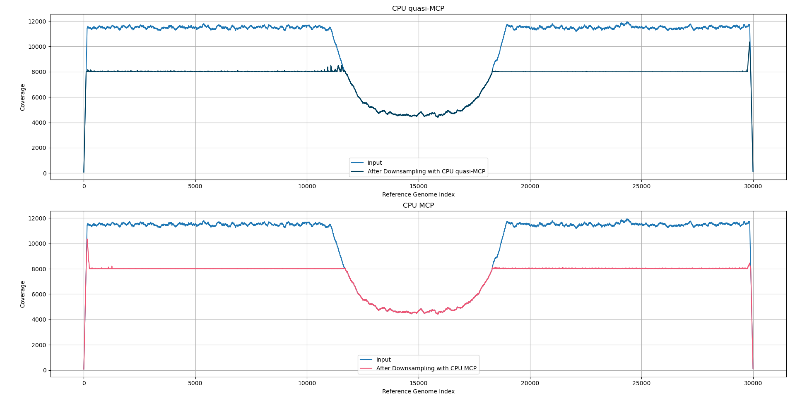

Genome Downsampler
==================

Efficient coverage-constrained downsampling of paired sequencing reads in BAM files. We have formulated the BAM downsampling problem as network min-cost max-flow problem. Later we've found that this transformation have been previously formulated in 2011 by Ding et al. [Ding-formulation]_.

Below we provide two simple examples proving usefulness of our solution. In Figures `real-data`_ and `synthetic-hole`_ we present respectively SARS-CoV-2 real-world example and synthetic data with a "hole" of coverage at the middle, both as a coverage function before and after downsampling.

.. _real-data:

.. figure:: images/quasi_mcp_vs_mcp_coverage_comparation_real_2000.png
   :alt: SARS-CoV-2 example coverage function. Result matches specified max coverage of 2 thousand per base pair.
   :align: center
   :width: 90%

   Results of downsampling on a real-world SARS-CoV-2 paired-end RNA dataset. The max coverage was set to 2 thousand reads. Result is almost ideal, only with very shrink and local overlapping reads. If original coverage was less than max coverage, all the reads all preserved to provide complete data in the lower coverage region.

.. _synthetic-hole:

   Results on synthetic data with a large coverage gap in the middle, it nicely presents how reads from low-coverage regions are being preserved in output BAM file. Max coverage was set to 8 thousand reads per base pair.

More than 2M reads downsampled to 1M reads with almost flat coverage in 10 seconds on a consumer-class laptop? Yes, it is possible with this tool. You can manage waiting few minutes and want to prioritise best quality reads instead of hard cut filter? This also is possible! Intrigued? See :doc:`introduction` to read more!

.. [Ding-formulation] Ding, L., Fu, B., Zhu, B. (2011). Minimum Interval Cover and Its Application to Genome Sequencing. In: Wang, W., Zhu, X., Du, DZ. (eds) Combinatorial Optimization and Applications. COCOA 2011. Lecture Notes in Computer Science, vol 6831. Springer, Berlin, Heidelberg. https://doi.org/10.1007/978-3-642-22616-8_23

.. toctree::
   :maxdepth: 2
   :caption: Contents

   introduction
   theory
   cpp_cli
   c_api
   python
   benchmarks
   development
