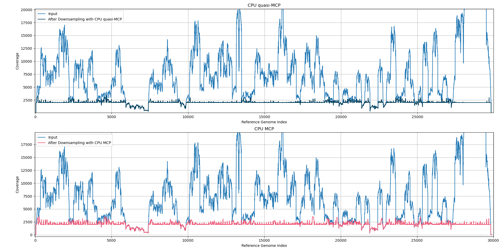

Introduction
============

Why downsampling exists
-----------------------

Genome studies often look for mutations, which are local differences in an observed organism's genome to a reference organism' genome. It is not a trivial task to find such a modification in genome code, because sequencing methods does not return one long genome string of an examined organism, instead it returns many (even tens of millions) of short reads (e.g. length of 150 for 30000 reference genome length). Reads can be mis-mapped, overlap, and cover the reference unevenly, making it even more challenging problem.

Thus genomic researchers meet very computationally expensive problem. The bigger the organism's genome code, the vigger the issue. How to analyse such big volume of data efficiently without loosing too much of valuable information? We propose to downsample it first, preserving almost a flat coverage of reference genome indices (prioritising best quality reads) and then use new, downsampled BAM file for further analysis. All fully configurable, natively handling paired-end reads and aplicon regions. Easy to incorporate into yours preprocessing pipeline! We provide a CLI tool, Python library and C/C++ APIs.

What do we handle:

* Paired-end reads — we keep or drop the whole pair, never one mate alone.
* Amplicons (intervals on the reference) may be given. Pairs with both mates in one amplicon are preferred over pairs split across amplicons if such configurable is set (either strict filtering out or prioritisation).
* Read MAPQ (mapping quality) guides which reads to prefer when several downsamples are possible (strict cut or prioritisation as well).

Goal
----

Find the smallest set of paired reads such that every reference index has coverage at least :math:`m`, preferring higher MAPQ (and, when enabled, same-amplicon pairs) — without reducing coverage below :math:`m` anywhere that already met it before downsampling.

What this software does
-----------------------

Genome Downsampler reads an aligned BAM file, runs a solver on each reference region, and writes a smaller BAM that still meets a per-base coverage target.

.. note::
  Multi-region BAM files are supported natively, however only a common max coverage setting is supported, so if you need other behavior, split your file first into few single-region BAM files and merge at the end. You can use ``samtools`` tools for it.

Our tool does not look at ACGT letters during optimization, it uses only reference indices, read intervals, MAPQ, and optional amplicon metadata. It provides RAM usage improvements over reading the complete reads. The output BAM file however is complete, and filtered data is saved in the same order as in original file.

Supported interfaces:

* C++ command-line application (main tools)
* Python package (``genome_downsampler``) - same pipeline as the CLI for scripting; PyPI/bioconda packaging is planned, so it will be easy to package this tool.
* C shared library (``libgds_c``) - created mostly for Python/C API integration, however it can be compiled and used from any other C API.

Internal libraries:

* C++ ``qmcp-solver`` library - solvers for BAM API objects
* C++ ``bam-api`` library - wrapper around HTSlib with filtering and efficient BAM I/O (minimal RAM, loads only what is needed)
* C++ ``min-cost-flow-solver`` - max-flow solvers, written from scratch for our specific network structure. Currently underperforms OR-Tools, but are planned to replace them in the future.
* C++ ``logging`` library - small lib for logging with 3 verbosity levels.
* C++ ``reads-gen`` library - small lib for generation of synthetic data for tests.

Platform support is GNU/Linux (tested on Ubuntu 22.04 in CI).

Motivating dataset
------------------

Our main test case is paired-end RNA sequencing for SARS-CoV-2:

* reference length :math:`N \approx 3 \times 10^4` bp
* read length :math:`n \approx 150` bp
* on the order of :math:`10^7` read pairs (:math:`2 \times 10^7` mates)

So :math:`M \gg N`. Good algorithms should limit how strongly runtime and memory grow with the number of input reads :math:`M`.

.. _real-data-2:

   Results of downsampling on a real-world SARS-CoV-2 paired-end RNA dataset. The same as in index page.

See :doc:`theory` for the formal definitions and the flow-network formulation.
