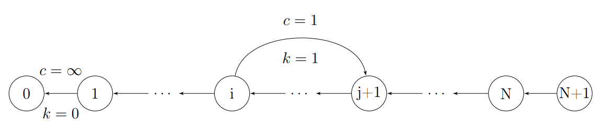

Theory
======

We model the reference as positions :math:`S = \{0, 1, \ldots, N-1\}`. A **read** :math:`R` is a contiguous interval on :math:`S` with length :math:`l(R)`. For downsampling we only need start/end indices and quality scores, not the base sequence.

Coverage
--------

Given a set of reads :math:`Q`, **coverage** at position :math:`i \in S` is

.. math::

   C_Q(i) = \bigl|\{ R \in Q : i \in R \}\bigr|.

**Paired reads** form a partition :math:`\mathcal{Q} = \{I_0, I_1, \ldots\}` of :math:`Q`, where each **2-interval** :math:`I` has one or two reads (a pair has :math:`|I| = 2`). Coverage uses the union of all mates: :math:`C_{\mathcal{Q}} = C_{\bigcup I}`.

Target coverage
---------------

Given a minimum coverage parameter :math:`m`, define the **cap function**

.. math::

   b(i) = \min\bigl(m,\; C_Q(i)\bigr).

A subset :math:`Q' \subseteq Q` **covers** :math:`S` with respect to :math:`b` when :math:`C_{Q'}(i) \ge b(i)` for all :math:`i \in S`. For pairs, :math:`\mathcal{Q}' \subseteq \mathcal{Q}` must cover when we take all reads in the chosen 2-intervals.

**Rule:** if an index already has coverage below :math:`m` in the input, downsampling must not lower it further.

Problems
--------

**MCP (Multi Cover Problem)** — find a minimum-size :math:`Q' \subseteq Q` that covers :math:`S` with respect to :math:`b`.

**2MCP (Paired Multi Cover Problem)** — same, but :math:`\mathcal{Q}' \subseteq \mathcal{Q}`; pairs are kept or removed together.

**QMCP / 2QMCP** — among all MCP / 2MCP solutions, minimise total quality :math:`\sum_{R \in Q'} q(R)` (see below).

2MCP is **NP-hard** (related to :math:`c`-interval multicover in the literature). A practical **2-approximation** for 2MCP solves MCP first, then adds pairs needed to restore the paired structure.

Amplicons and quality
---------------------

An **amplicon** :math:`A = [k, l]` is a reference interval. Read :math:`R` lies in :math:`A` when it fits entirely inside :math:`A`.

Let :math:`q_r(R) \in (0,1]` be normalised MAPQ. With amplicon **grading** enabled, quality becomes

.. math::

   q(R) =
   \begin{cases}
     q_r(R) - 1, & \text{if all mates of } R \text{ lie in one amplicon} \\
     q_r(R),     & \text{otherwise}
   \end{cases}

so same-amplicon pairs rank above cross-amplicon pairs. Three modes in the app:

1. **Ignore** amplicons — optimise MAPQ only.
2. **Filter** — drop pairs split across amplicons in preprocessing.
3. **Grade** — rescale MAPQ as above and let the solver prefer in-amplicon pairs.

MCP as minimum-cost circulation
-------------------------------

Each read :math:`R` from start :math:`R_0` to end :math:`R_{l(R)-1}` becomes a **forward arc** :math:`\mathrm{arc}(R) = R_0 (R_{l(R)-1} + 1)`.

Build a directed graph :math:`G = (V, E)` with

.. math::

   V &= \{0, 1, \ldots, N, N+1\}, \\
   F &= \{\mathrm{arc}(R) : R \in Q\}, \\
   B &= \{v(v-1) : v \in V \setminus \{0\}\}, \\
   E &= B \cup F.

Backward arcs :math:`B` link consecutive positions; forward arcs :math:`F` are reads.

   Network flow schema, :math:`i` and :math:`j` are respectively start and end index of a read.

**Demand** :math:`d : V \to \mathbb{Z}` (flow imbalance per node):

.. math::

   d(v) =
   \begin{cases}
     -b(0), & v = 0 \\
     b(v) - b(v+1), & v \in \{1,\ldots,N-1\} \\
     b(N), & v = N+1
   \end{cases}

**Capacity** and **cost** on arcs:

.. math::

   c(e) =
   \begin{cases}
     1, & e \in F \\
     \infty, & e \in B
   \end{cases}
   \qquad
   k(e) =
   \begin{cases}
     1, & e \in F \\
     0, & e \in B
   \end{cases}

A circulation :math:`f` picks forward arcs with :math:`f(e) = 1`. The selected reads are

.. math::

   Q_f = \{ R \in Q : f(\mathrm{arc}(R)) = 1 \}.

Because forward arcs cost 1 and backward arcs cost 0, minimum-cost circulation cost equals :math:`|Q_f|`. Any feasible circulation satisfies :math:`C_{Q_f}(i) \ge b(i)` for all :math:`i` — so a min-cost circulation solves **MCP**.

Quasi-MCP
---------

Exact MCP needs a **minimum-cost flow** solver. **Quasi-MCP** relaxes this: find **any feasible circulation** (a **maximum flow** problem) instead of minimum cost. It is faster and, in our experiments on similar-length reads, often gives comparable coverage.

.. note::

   We suspect that on inputs where every read has the same length, max-flow quasi-MCP may coincide with MCP; that remains to be proved formally.

This codebase implements quasi-MCP on CPU (push-relabel, with an OpenMP variant) and via OR-Tools, then extends to 2MCP with pairing logic. See :doc:`benchmarks` for solver performance.

